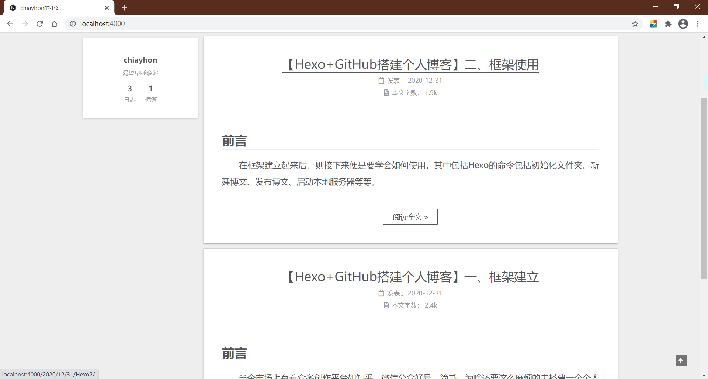

---

title: 【Hexo+GitHub搭建个人博客】二、框架使用及技巧

date: 2020-12-31 12:48:42

tags: Hexo

---
# 前言

　　在框架建立起来后，则接下来便是要学会如何使用，其中包括Hexo的命令包括初始化文件夹、新建博文、发布博文、启动本地服务器等等。同时学习如何使用一些小技巧，

<!-- more -->


# Hexo文件结构

　　在介绍命令前，先了解一下目录下的主要文件夹:

- `_config.yml` :  博客配置文件，配置了**博客的各项设置**
- `source` : 资源文件夹，里面有所有的**博文或是独立页面**，存放着文章、草稿等资源
- `themes` : 主题文件夹，包含了一个或多个**主题**，Hexo 会根据主题来生成静态页面
- `scaffolds`  : 模板文件夹，当新建文章时，Hexo会根据模板文件夹里的**模板**来建立文件。


# Hexo基础命令

## 初始化

```
hexo init [博客文件夹名]
```

　　**新建一个博客网站**，如果没有指定文件夹，就在当前目录创建默认文件夹


## 新建博客


```
hexo new [layout] <title>

hexo new [layout] [Option] <title>
```

　　**创建一篇博文**:

　　`layout`是可选项，用来设置布局(layout)参数。常见布局的有 `post`（文章) 、`page`(页面) 、`draft` (草稿)三种，如果不填写，默认将会选择 `post`。

　　`title` 则是**必选项**，会做为文件名称，同时生成的文件就是 `<title>.md` 。例如，下面会生成一个标题为 `新的博客` 的 `新的博客.md` 文件

```
hexo new "新的博客"
```

　　但是有时候我们创建一篇博文，它的标题和文件名不一定是相同的，这时候就要用到 `Option` 参数了。

　　`Option`是可选项，默认情况下，Hexo会使用文章的标题来决定文章文件的路径。可以使用 `-p` 或`--path` 参数来**自行决定文件**的文件名和标题：

```
hexo new page --path about/test "新的标题"  
```

　　上述命令将在 `source/about/` 创建文件名为 `test.md` ，标题为 `新的标题` 文件。

参数Option | 描述
---|---
`-p`, `--path` | 自定义新文章的路径
`-r`, `--replace` | 如果存在同名文章，将其替换
`-s`, `--slug` | 自定义帖子的URL


## 发布博客


```
hexo publish  <filename>
```

　　发布命令，会将`/source/_drafts`目录下的草稿发布出去。如果创建了一个草稿，想要发布出去，则需要用到此命令。`<filename>` 则是草稿的文件名，注意**不包括后缀名**。

　　 

## 启动本地服务器


```
hexo server
```

　　启动服务器，将你的博客暂时可以**从本地直接访问**，方便查看效果。默认情况下，访问网址为： `http://localhost:4000/`，按 `Ctrl + c` 停止.


## 清除缓存


```
hexo clean
```

　　**清除**缓存文件和已生成的静态文件。在某些情况，如对站点的更改**无论如何也不生效**，可能需要运行该命令

　　`hexo generate` 与 `hexo deploy` 这两个命令和部署有关，会在具体讲如何部署上线时展开讲解。


# 博文相关

　　明白了如何使用 `Hexo` 生成想要的文件以及如何预览之后,就可以开始进行博文的撰写了。在 `source` 目录下，可以找到所有生成的文章，可以使用任何喜欢的文本编辑器进行编辑。Hexo 的博文使用的是 markdown 来撰写的，当然也可以插入一些 HTML 代码来进行自定义。这一部分主要是关于文章帖子(post)。


## 语法：Markdown

　　Markdown 是一种标记语言，语法简单，易阅读易编写，可以让用户完全脱离鼠标写出样式丰富的文档。其语法可以自行去学习[基础语法](https://www.markdownguide.org/basic-syntax)和[扩展语法](https://www.markdownguide.org/extended-syntax)，这里仅介绍几个。


### 代码块进阶用法

　　可以通过为代码块附加参数的形式为其添加更丰富的信息提示，效果如下：

``` java java https://www.baidu.com/ 百度
System.out.println("Hello world")
```

　　用法规则：

``` markdown
​``` [language] [title] [url] [link text]
code snippet
​```
```

　　其中，各参数意义如下：

- langugae：语言名称，引导渲染引擎正确解析并高亮显示关键字
- title：代码块标题，将会显示在左上角
- url：链接地址，如果没有指定 link text 则会在右上角显示 link
- link text：链接名称，指定 url 后有效，将会显示在右上角

　　url 必须为有效链接地址才会以链接的形式显示在右上角，否则将作为标题显示在左上角。以 url 为分界，左侧除了第一个单词会被解析为 language，其他所有单词都会被解析为 title，而右侧的所有单词都会被解析为 link text。

　　如果不想填写 title，可以在 language 和 url 之间添加至少三个空格。


## 技巧：内置标签

### Front-matter

Hexo 每一篇生成的文章开头都会有一段由两行 「---」包裹起来的内容，称为 **Front-matter**，这是配置文章信息的部分


```
--- 

title: draft

date: 2020-12-31 23:25:36

tags:

---
```

　　`title` 指的是博文的标题，默认生成的标题与使用 `hexo new` 命令中输入的 `<title>` 相同，但是可以自行更改。

　　`date` 指的是文件被发布的时间，如果是直接生成的时间，那就与生成时间相同，如果是由 draft 通过 `hexo publish` 命令发布的，那就与 `publish` 的时间相同。

　　`tags` 指的是文章的标签，可以打上多个，如下所示：
　　

```
tags:

    - tag1

    - tag2

    - tag3
```


### 摘要

　　每一篇生成的博文应该都会出现在 `Hexo` 的主页上。如果不使用摘要，那么每一篇文章都会**全文显示**在主页上，这是很不美观，也很浪费资源的一种方式。

　　如果使用摘要，那么主页上只会显示一小段内容，不仅吸引了读者，还能使得整个博客网站更加优雅。摘要必须写在文章开头，紧接着文件头部。

　　当摘要写作完成后，另起一行输入 `<!-- more -->` 即可，这样上面的内容就能被识别，并显示在主页上。不过，这段摘要同样也会在博文页面中被显示出来，需要注意。

　　效果如下：





### 添加emoji表情

　　直接去❤️[这里](https://emojipedia.org/)复制想要的表情即可


### 高亮代码块

　　设置 `highlight.enable: true` 和 `highlight.auto_detect: true`

　　如果将语言设置成 `diff` 可在代码前面添加 `+` 、`-` 号高亮代码，能比较好的反映代码的增删。

``` diff /config.yml 
highlight:
  enable: true
  line_number: true
  auto_detect: true
  tab_replace: ''
- wrap: true
+ wrap: true
```


更多高亮设置可参考[这篇博文](https://www.ofind.cn/blog/HEXO/HEXO%E4%B8%8B%E7%9A%84%E8%AF%AD%E6%B3%95%E9%AB%98%E4%BA%AE%E6%8B%93%E5%B1%95%E4%BF%AE%E6%94%B9.html#%E8%AE%BE%E7%BD%AE%E4%BB%A3%E7%A0%81%E6%B7%BB%E5%8A%A0%E5%88%A0%E9%99%A4%E6%A0%87%E8%AE%B0)



### note 笔记标签

　　通过 note 标签可以为段落添加背景色，效果如上，语法如下：

```

文本内容 (支持行内标签)

```

　　支持的 class 种类包括 `default` `primary` `success` `info` `warning` `danger`，也可以不指定 class。


### label 标签

通过 label 标签可以为文字添加背景色，语法如下：

```

```

支持的 class 种类包括 `default` `primary` `success` `info` `warning` `danger`，默认使用 `default` 作为缺省。

使用示例如下：

```English
I heard the echo, 
Open to the lonely soul of 
Repeat outrightly, but also repeat the well-being of
Eventually 
 I am

Do not withered undefeated fiery demon rule
Heart rate and breathing to bear 
Bored
```

> I heard the echo, 
> Open to the lonely soul of 
> Repeat outrightly, but also repeat the well-being of
> Eventually 
>  I am
> 
> Do not withered undefeated fiery demon rule
> Heart rate and breathing to bear 
> Bored

### button 按钮

通过 button 标签可以快速添加带有主题样式的按钮，语法如下：

```

```

也可简写为：

```

```

其中， 图标 ID 来源于 [FontAwesome](https://fontawesome.com/v4.7.0/icons/) 。

使用示例如下：

```




```











### tab 标签

tab 标签用于快速创建 tab 选项卡，语法如下

```

  <!-- tab [Tab caption]@[icon] -->
  标签页内容（支持行内标签）
  <!-- endtab -->

```

其中，各参数意义如下：

- Unique name: 全局唯一的 Tab 名称，将作为各个标签页的 id 属性前缀
- index: 当前激活的标签页索引，如果未定义则默认选中显示第一个标签页，如果设为 - 1 则默认隐藏所有标签页
- Tab caption: 当前标签页的标题，如果不指定则会以 Unique name 加上索引作为标题
- icon: 在标签页标题中添加 Font awesome 图标

使用示例如下：

```

  <!-- tab 标签页1 -->
    标签页1文本内容
  <!-- endtab -->
  <!-- tab 标签页2 -->
    标签页2文本内容
  <!-- endtab -->
  <!-- tab 标签页3 -->
    标签页3文本内容
  <!-- endtab -->

```


  <!-- tab 标签页1 -->
    标签页1文本内容
  <!-- endtab -->
  <!-- tab 标签页2 -->
    标签页2文本内容
  <!-- endtab -->
  <!-- tab 标签页3 -->
    标签页3文本内容
  <!-- endtab -->



### 引用站内链接

可以通过如下语法引入站内文章的地址或链接：

```


```

其中，`slug` 表示 `_post` 目录下的 Markdown 文件名。

`post_path` 标签将会渲染为文章的地址，即 `permalink`；而 `post_link` 标签将会渲染为链接，可以通过 `title` 指定链接标题。

如以下标签将会生成  

```

```

而以下标签则会生成 

```

```

这种站内引用方式比直接使用 url 引用的形式更为可靠，因为即使修改了 `permalink` 格式，或者修改了文章的路由地址，只要 Markdown 文件名没有发生改变，引用链接都不会失效。

### 插入 Swig 代码

如果需要在页面内插入 Swig 代码，包括原生 HTML 代码，JavaScript 脚本等，可以通过 raw 标签来禁止 Markdown 引擎渲染标签内的内容。语法如下：

```

content

```

该标签通常用于在页面内引入三方脚本实现特殊功能，尤其是当该三方脚本尚无相关 hexo 插件支持的时候，可以通过写原生 Web 页面的形式引入脚本并编写实现逻辑。

### 插入 Gist

如果需要在页面内插入 Gist 上的代码片段时，可以使用如下标签:

```

```

其中，各参数意义如下：

- gist_id: Gist 仓库页面 url 中最后一段随机字符串
- filename: Gist 中的文件名

如果 Gist 中只有一个文件，可以不用指定 filename，也可以通过 JavaScript 脚本的形式直接引入，如：

```
<script src="https://gist.github.com/Coodool/cb4ff46a3523955dd4b918dd775b6774.js"></script>
```

如果 Gist 中有多个文件，可以在标签内输入 filename 来指定只引入某个文件，如果没有指定 filename，将会引入 Gist 中的所有文件。另外，引用 JavaScript 脚本形式无法精确控制只引入某一个文件，将会同时引入 Gist 中的所有文件。

如果指定了与 Gist 无法匹配的 filename，页面上将不会显示任何标签内容。所以，一般在 Gist 只有一个文件的情况下无需指定 filename。

在页面中引入 Gist 代码段将会同时从 github 服务器上下载脚本与 CSS 样式文件，由于国内访问 github 服务器延迟较高，往往资源文件连接和下载的速度很慢，会阻塞页面的渲染进程导致短时白屏。

## 写作工具

　　个人用的写作工具是[Typora](https://typora.io/#windows)，Typora有关写作和图片处理经验可以参考[这篇文章](https://cloud.tencent.com/developer/article/1600295)，这里就不多叙述了

# 自定义页面

　　博客除了主页，还有很多其他页面，Next允许用户在菜单中添加自定义页面。这一部分主要是关于页面(page)。

至此如何使用框架也基本介绍完了，更详细的内容详见[Hexo官方文档](https://hexo.io/docs/)


