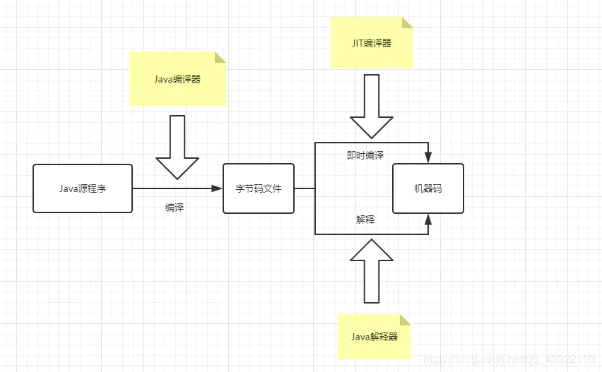

# 前言

java基础总结

<!-- more -->

# **1. Java入门**

## **1.1 java语言特点**

- 简单易学
- **面向对象(封装、继承、多态)**
- **平台无关性( JVM 实现跨平台)**
- 可靠性
- 安全性
- **支持多线程(内置多线程支持)**
- 支持网络编程且方便
- **编译与解释并存**

## **1.2 JVM, JRE, JDK 介绍及区别**

**JDK ( Java Development Kit )** : java 开发工具包，提供 java 的开发环境和运行环境。

> 在jdk文件夹中，jdk/jre/**bin**可以认为该目录即为jvm

**JRE ( Java Runtime Environment ) :** java 运行环境，提供 java 的运行环境。

> jre即由bin+lib组成，也就是说jre包含了jvm以及执行class文件所需要的类库lib。

**JVM (Java Virtual Machine)** : java虚拟机，将字节码文件翻译成对应平台的机器码。

在jdk目录下面有六个文件夹、一个src类库源码压缩包、和其他几个声明文件。真正在运行java时起作用的是以下四个文件夹：

bin : 最主要的是编译器(javac.exe)  

  	 include : java和JVM交互用的头文件    

​	 lib：类库  	   jre : java运行环境

总的来说jdk包括开发工具和jre，jre包括核心类库和jvm

## **1.3 java跨平台性**

jvm是java跨平台的核心，jvm能将字节码文件解释成机器码实现操作系统的API调用，而不同平台有对应版本的jvm。java源程序编译成字节码后，即可在不同平台的jvm下解释、调用操作系统API，实现“一次编译，到处运行”。

> Java 能够跨平台运行的核心在于 JVM 。不是 Java 能够跨平台，而是它的 jvm 能够跨平台。我们知道，不同的操作系统向上的 API 肯定是不同的，那么如果我们想要写一段代码调用系统的声音设备，就需要针对不同系统的 API 写出不同的代码来完成动作。
>
> 而 Java 引入了字节码的概念，jvm 只能认识字节码，并将它们解释到系统的 API 调用。针对不同的系统有不同的 jvm 实现，有 Linux 版本的 jvm 实现，也有 Windows 版本的 jvm 实现，但是同一段代码在编译后的字节码是一样的。引用上面的例子，在 Java API 层面，我们调用系统声音设备的代码是唯一的，和系统无关，编译生成的字节码也是唯一的。但是同一段字节码，在不同的 jvm 实现上会映射到不同系统的 API 调用，从而实现代码的不加修改即可跨平台运行。

## **1.4 “编译与解释并存”？**

重点讲.class->机器码 这一步。在这一步 jvm 类加载器首先加载字节码文件，然后通过解释器逐行解释执行，这种方式的执行速度会相对比较慢。而且，有些方法和代码块是经常需要被调用的，也就是所谓的热点代码，所以后面引进了 JIT 编译器，JIT 属于运行时编译。当 JIT 编译器完成第一次编译后，其会将字节码对应的机器码保存下来，下次可以直接使用。而我们知道，机器码的运行效率肯定是高于 Java 解释器的。这也解释了我们为什么经常会说 Java 是编译与解释共存的语言。

# **2. java语法**

##  **2.1 continue、break、和 return 的区别是什么？**

1. continue ：指**跳过**当前的这一次循环，继续下一次循环。
2. break ：指**跳出**整个循环体，继续执行循环下面的语句。
3. return 用于跳出所在方法，结束该方法的运行。return 一般有两种用法：

- 1. return; ：直接使用 return 结束方法执行，用于**没有返回值函数的方法**
  2. return value; ：return 一个特定值，用于**有返回值函数的方法**

## **2.2  ==和 equals 的区别**

1. == : 它的作用是**判断两个对象的地址**是不是相等。即：判断两个对象是不是同一个对象。(**基本数据类型****比较的是值****，引用数据类型****比较的是内存地址**)

因为 Java 只有值传递，所以，对于 == 来说，不管是比较基本数据类型，还是引用数据类型的变量，其本质比较的都是值，只是引用类型变量存的值是对象的地址。

1. **equals()** : 它的作用也是判断两个对象是否相等，它**不能用于比较基本数据类型的变量**。equals() 方法存在两种使用情况：

- - 情况 1：类**没有重写（覆盖）** equals()方法。则通过equals()比较该类的两个对象时，**等价于“==”**比较这两个对象。使用的默认是 Object类equals()方法。

- - 情况 2：类**重写（覆盖）**了 equals()方法。一般，我们都覆盖 equals()方法来两个对象的内容相等；若它们的内容相等，则返回 true(即，认为这两个对象相等)。

equals()方法存在于Object类中，而Object类是所有类的直接或间接父类。

注：

- String 中的 equals 方法是被重写过的，因为 Object 的 equals 方法是比较的对象的内存地址，而 String 的 equals 方法比较的是对象的值。
- 当创建 String 类型的对象时，虚拟机会在常量池中查找有没有已经存在的值和要创建的值相同的对象，如果有就把它赋给当前引用。如果没有就在常量池中重新创建一个 String 对象。

## **2.3 &和&&(|和||)**

- &运算符有两种用法：**(1)按位与；(2)逻辑与**。

- &&运算符是**短路与**运算。

逻辑与跟短路与的差别是非常巨大的，虽然二者都要求运算符左右两端的布尔值都是true，整个表达式的值才是true。

&&之所以称为短路运算，是因为如果&&左边的表达式的值是false，右边的表达式会被直接短路掉，不会进行运算。

很多时候我们可能都需要用&&而不是&，例如在验证用户登录时判定用户名不是null而且不是空字符串，应当写为：username != null &&!username.equals("")，二者的顺序不能交换，更不能用&运算符，因为第一个条件如果不成立，根本不能进行字符串的equals比较，否则会产生NullPointerException异常。

# **3. java数据类型**

## **3.1 Java 中的基本数据类型种类、对应的包装类型、占用多少字节**

Java中有 **8 种基本数据类型**，分别为：

- 6 种数字类型 ：byte、short、int、long、float、double
- 1 种字符类型：char
- 1 种布尔型：boolean。

这八种基本类型都有对应的包装类分别为：Byte、Short、Integer、Long、Float、Double、Character、Boolean

| 基本类型            | 位数 | 字节 | 默认值  |
| ------------------- | ---- | ---- | ------- |
| int (默认整型)      | 32   | 4    | 0       |
| short               | 16   | 2    | 0       |
| long                | 64   | 8    | 0L      |
| byte                | 8    | 1    | 0       |
| char                | 16   | 2    | 'u0000' |
| float               | 32   | 4    | 0f      |
| double (默认浮点型) | 64   | 8    | 0d      |
| boolean             | 1    |      | false   |

对于 boolean，官方文档未明确定义，它依赖于 JVM 厂商的具体实现。逻辑上理解是占用 1 位，但是实际中会考虑计算机高效存储因素。

注意：

1. Java 里使用 long 类型的数据一定要在数值后面加上 **L**，否则将作为整型解析：
2. Java 里使用 float类型的数据一定要在数值后面加上 **F**，否则将作为双浮点·型解析：
3. char a = 'h'char :单引号，String a = "hello" :双引号